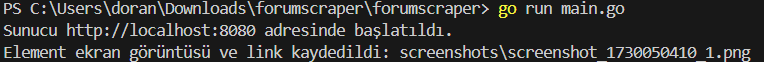
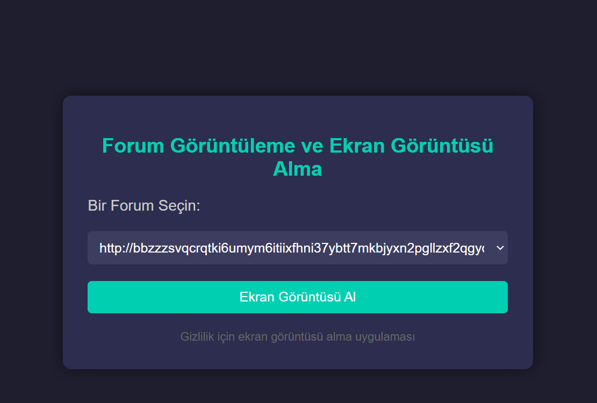

<h1> ForumScraperCLI </h1>

 ***ForumScraperCLI***
 , otomatik forum izlemeye yönelik bir komut satırı aracıdır. En az 10 forumdaki gönderileri sıyırıp tartışmaları, konuları ve anahtar kelimeleri gerçek zamanlı olarak izliyor. Bu araç, forum gönderilerini toplama sürecini basitleştirir; istihbarat toplamak ve forum etkinlikleriyle ilgili güncel bilgileri korumak için idealdir.

<h2>Özellikler</h2>

- **Otomatik Kazıma**: Çeşitli forumlardan veri toplar.
- **Gerçek Zamanlı İzleme**: Tartışmaları ve konuları anlık olarak izler.
- **Esnek Konfigürasyon**: Forum URL'lerini ve HTML öğesi seçicilerini kolayca ekleyebilir veya değiştirebilirsiniz.

<h2>Kullanım</h2>
Uygulamayı çalıştırmak için proje dizinine gidin ve şu komutu çalıştırın:  

<frameset><blockquote> <b> go run main.go </b> </blockquote> </frameset>  
Sunucu <a href="http://localhost:8080'">http://localhost:8080'</a> adresinde başlayacaktır. Tarayıcınızı açın ve  <a href="http://localhost:8080'">bu adrese </a> giderek forum izleme aracına erişin.    

<h2>Gönderileri Kazıma</h2>

<b>1.</b>Açılır menüden bir forum seçin.  
<b>2.</b>Seçilen forumdan ekran görüntüsü almak ve bağlantıları çekmek için <b>Ekran Görüntüsü Al </b>butonuna tıklayın.  
Uygulama, ilgili foruma giderek son gönderiyi alacak ve bağlantısını <b>links.txt</b> dosyasına ekleyecektir.
