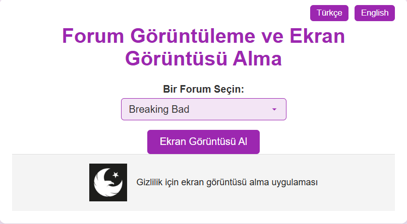

# ForumScraperCLI
## (TR) 

**ForumScraperCLI**, otomatik forum izlemeye yönelik bir komut satırı aracıdır. Birden fazla forumdaki gönderileri sıyırarak tartışmaları, konuları ve anahtar kelimeleri gerçek zamanlı olarak izler. Bu araç, forum gönderilerini toplama sürecini basitleştirir; istihbarat toplamak ve forum etkinlikleri hakkında güncel bilgi sahibi olmak için idealdir.

## Özellikler

- **Otomatik Kazıma**: Çeşitli forumlardan veri toplar.
- **Gerçek Zamanlı İzleme**: Tartışmaları ve konuları anlık olarak izler.
- **Esnek Konfigürasyon**: Forum URL'lerini ve CSS öğesi seçicilerini kolayca ekleyebilir veya değiştirebilirsiniz.

## Kurulum ve Docker Kullanımı

Bu proje Docker ile çalışacak şekilde yapılandırılmıştır. Docker, bağımlılıkların yönetimini basitleştirir ve aracı izole bir ortamda çalıştırmanıza olanak tanır.

### Docker ile Çalıştırma

1. **Docker İmajını Oluşturun**:
    
    Proje dizininde aşağıdaki komutu çalıştırarak Docker imajını oluşturun:
    
    ```bash
   
    docker-compose build
    
    ```
    
2. **Docker Konteynerlerini Başlatın**:
    
    Docker konteynerlerini arka planda çalıştırmak için:
    
    ```bash
    
    docker-compose up -d --build
    
    ```
    
    Bu işlem, iki konteyneri başlatır:
    
    - **tor_service**: Tor ağına erişim için bir proxy servisi sağlar, böylece araç .onion sitelerindeki forumlara erişebilir.
    - **forum_monitoring_app**: Forum verilerini sıyırmak ve ekran görüntüleri almak için ana uygulamayı çalıştırır.
3. **Konteynerlerin Çalıştığını Doğrulama**:
    
    Konteynerlerin başarıyla çalıştığını doğrulamak için aşağıdaki komutla durumu kontrol edebilirsiniz:
    
    ```bash
    
    docker ps
    
    ```
    
4. **Kayıtları İnceleme**:
    
    Ekran görüntüsü ve verilerin kaydedildiğinden emin olmak için `forum_monitoring_app` konteynerinin loglarını kontrol edin:
    
    ```bash
   
    docker logs forum_monitoring_app
    
    ```
    

### Arayüze Erişim

Konteynerler çalışmaya başladıktan sonra, bir web tarayıcısında http://localhost:8080 adresine gidin. Bu adres, ForumScraperCLI arayüzüne erişmenizi sağlayacak, burada forum gönderilerini izlemeye ve ekran görüntüsü almaya başlayabilirsiniz.

   

## Kullanım

1. **Bir Forum Seçin**: Açılır menüden izlemek istediğiniz forumu seçin.
2. **Ekran Görüntüsü Alın**: **Ekran Görüntüsü Al** butonuna tıklayın. Araç, seçilen foruma giderek sayfanın bir ekran görüntüsünü alır ve ekran görüntüsü başarıyla kaydedildiğinde bir başarı mesajı gösterir.
    
   
    
3. **Bağlantılara ve Ekran Görüntülerine Erişin**: Ekran görüntüleri ve sıyrılmış bağlantılar Docker konteyneri içinde saklanır. `forum_monitoring_app` konteyneri için Docker Desktop'ta **Files** sekmesine giderek `links.txt` dosyasını ve `screenshots` klasöründeki görselleri bulabilirsiniz.
   

---

## (EN)

**ForumScraperCLI** is a command-line tool designed for automatic forum monitoring. It scrapes posts from multiple forums to track discussions, topics, and keywords in real-time. This tool simplifies the process of collecting forum posts, making it ideal for gathering intelligence and staying updated on forum activities.

## Features

- **Automatic Scraping**: Collects data from various forums.
- **Real-Time Monitoring**: Instantly tracks discussions and topics.
- **Flexible Configuration**: Easily add or change forum URLs and CSS selectors.

## Setup and Docker Usage

This project is configured to run with Docker. Docker simplifies dependency management and allows you to run the tool in an isolated environment.

### Running with Docker

1. **Build the Docker Image**:
    
    Run the following command in the project directory to build the Docker image:
    
    ```bash
   
    docker-compose build
    
    ```
    
2. **Start Docker Containers**:
    
    To run the Docker containers in the background:
    
    ```bash
    
    docker-compose up -d --build
    
    ```
    
    This will start two containers:
    
    - **tor_service**: Provides a proxy service to access the Tor network, enabling the tool to reach forums on .onion sites.
    - **forum_monitoring_app**: Runs the main application for scraping forum data and taking screenshots.
3. **Verify Containers are Running**:
    
    To confirm the containers are running successfully, check their status with:
    
    ```bash
   
    docker ps
    
    ```
    
4. **Inspect Logs**:
    
    To ensure screenshots and data are being saved, check the logs of the `forum_monitoring_app` container:
    
    ```bash
    
    docker logs forum_monitoring_app
    
    ```
    

### Accessing the Interface


After the containers are up and running, open a web browser and go to http://localhost:8080. This will take you to the ForumScraperCLI interface, where you can begin monitoring forum posts and taking screenshots
    


## Usage

1. **Select a Forum**: From the dropdown menu, choose the forum you want to monitor.
2. **Take a Screenshot**: Click the **Take Screenshot** button. The tool will navigate to the selected forum, capture a screenshot of the page, and display a success message once the screenshot is saved.
    
   
    
3. **Access Links and Screenshots**: Screenshots and scraped links are stored within the Docker container. You can access these files by navigating to the **Files** section in Docker Desktop for `forum_monitoring_app`. Look for `links.txt` for the latest scraped links and the `screenshots` directory for the images.
